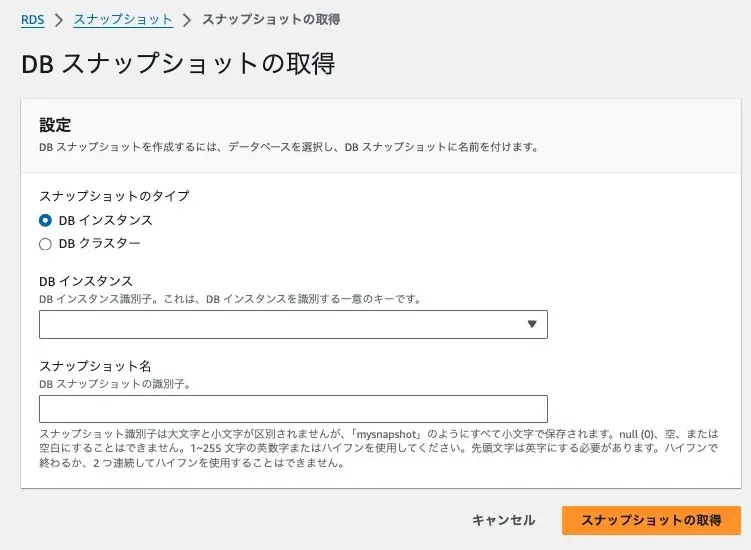
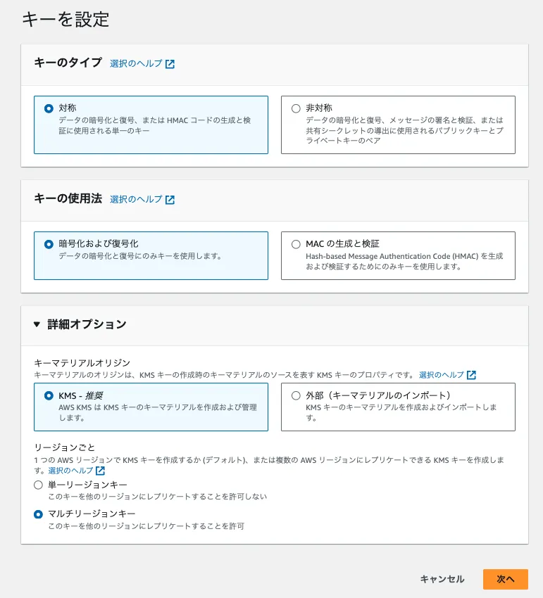
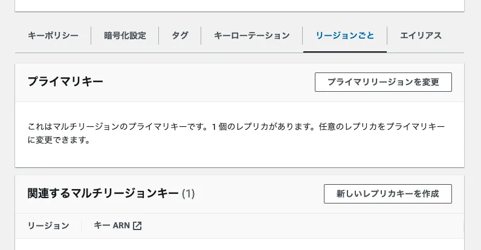
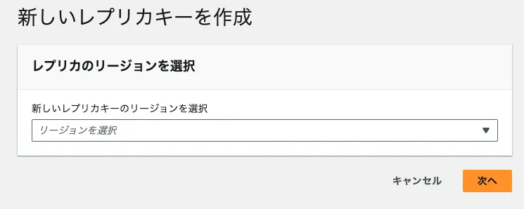
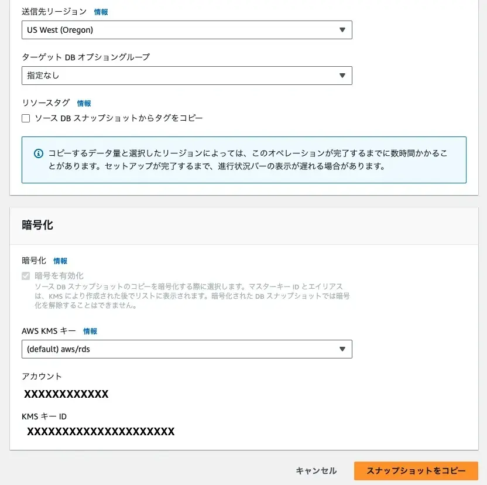
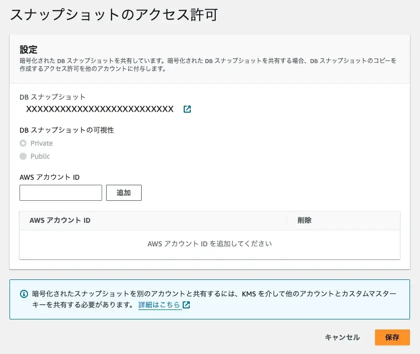
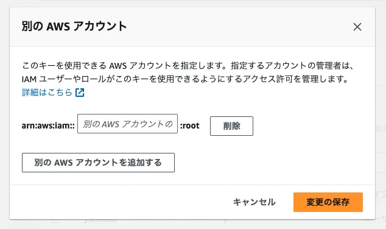
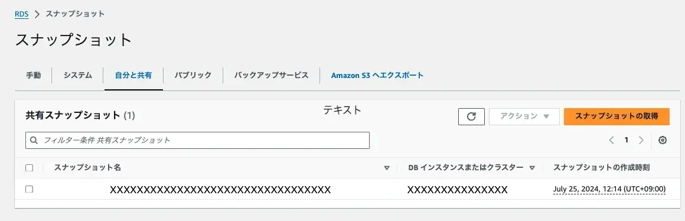
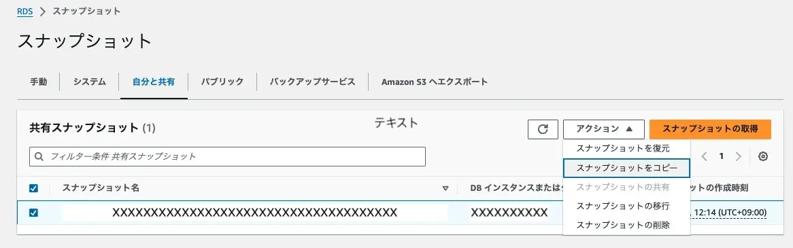
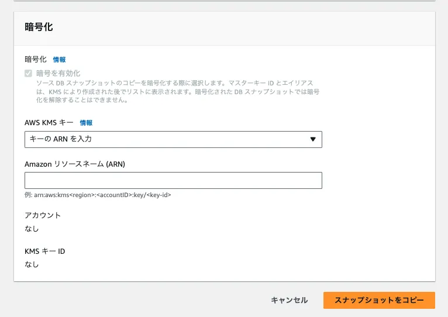

AWS環境で運用しているアプリケーションは、複数のアカウントや異なるリージョンで構築されることがあります。この記事では、そのような状況でAWS RDSのスナップショットを共有し、復元する方法を詳しく説明します。

## 作業概要

以下のような複数アカウント・複数リージョン運用のケース。

- アカウントA: 東京リージョン
- アカウントB: オレゴンリージョン

アカウントAの東京リージョンの暗号化しているRDSインスタンスのスナップショットを、アカウントBのオレゴンリージョンで復元したい。

## 忙しい人の為の手順書

**アカウントAにて**
1. 対象RDSインスタンスのスナップショットをとる
1. アカウントBと共有するカスタマー管理キーをマルチリージョンで作成する
1. 上記のカスタマー管理キーのレプリカをオレゴンリージョンに作成する
1. スナップショットを手順2にて作成したカスタマー管理キーでオレゴンリージョンにコピーする
1. 手順4でコピーしたスナップショットをアカウントBに共有する
1. 3で作成したレプリカのカスタマー管理キーをアカウントBに共有する

**アカウントBにて**
1. オレゴンリージョンのRDS共有スナップショットを確認する
1. 手順1の共有スナップショットをコピーする
    - 共有スナップショットを復元できませんが、コピーすることで復元可能になります。
1. 手順2にてコピーしたスナップショットを復元する

## スナップショット移行の手順

### アカウントAで作業

#### スナップショットの作成
アカウントAで対象となるRDSインスタンスのスナップショットを作成します。

#### KMSカスタマー管理型のキーの作成
アカウントAでアカウントBと共有するマルチリージョン対応のKMSキーを東京リージョンで作成します。

KMS > カスタマー管理型のキー > キーの作成

#### KMSカスタマー管理型のキーのレプリカ作成
アカウントAにて、東京リージョンで作成したキーのレプリカをオレゴンリージョンで作成します。

KMS > カスタマー管理型のキー > キー ID: XXXXXXXXXXXXXXX

関連するマルチリージョンキー > 新しいレプリカキーを作成

**オレゴンリージョン**を選択する。

#### スナップショットのコピー
アカウントAで作成したスナップショットを、手順2で作成したKMSキーを使用してオレゴンリージョンにコピーします。

RDS > スナップショット > スナップショットをコピー

AWS KMSキーに上で作成したキーを指定する。

#### スナップショットの共有
アカウントAでコピーしたスナップショットをアカウントBと共有します。

AWSアカウントIDに、**アカウントBのID**を入力する。

#### KMSキーの共有
アカウントAで作成したレプリカのカスタマー管理キーをアカウントBに共有する。

**アカウントBのID**を入力する。

### アカウントBで作業

#### オレゴンリージョンのRDS共有スナップショットの確認
共有スナップショットが参照できるか確認します。

#### 共有スナップショットのコピー
アカウントBで共有されたスナップショットをコピーします。

Amazonリソースネーム(ARN): 先ほど共有した**レプリカのカスタマー管理キーのARN**を入力する。

#### スナップショットのリストア
アカウントBでコピーしたスナップショットをリストアします。

この手順により、AWS RDSのスナップショットを異なるアカウントとリージョン間で移行することが可能となります。


