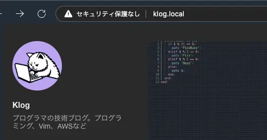

## 概要

複数のプロジェクトを同時に開発する際に、Nginxをリバースプロキシとして使用し、hostsファイルでローカルドメインを設定する方法を紹介します。

## 複数プロジェクト開発の問題

ローカル開発環境では通常、ブラウザに `localhost:ポート番号` を入力してアクセスします。しかし、複数のプロジェクトを開発していると、ブラウザのアドレスバーに `localhost` と入力した際に他のプロジェクトのパスがサジェストされてしまい、煩わしいことがあります。

※単にhostsファイルにドメインを設定するだけで上記問題は解決できます。大袈裟ではありますが、今回は勉強がてらNginxのリバースプロキシを設定しました。


## 設定方法

以下の環境を前提に話を進めます。別の環境の場合は適宜読み替えてください。

    $ sw_vers
    ProductName:            macOS
    ProductVersion:         14.5
    BuildVersion:           23F79
    
    $ brew -v
    Homebrew 4.3.15-52-ge590bca
    Homebrew/homebrew-cask (git revision 7adc70cd367; last commit 2024-08-04)
    
    $ nginx -v
    nginx version: nginx/1.27.0

### Hostsファイルにローカルドメインを設定する

    sudo vim /etc/hosts

以下のように、127.0.0.1に対して対象としたいプロジェクト用のローカルドメインを設定します。

```diff
##
# Host Database
#
# localhost is used to configure the loopback interface
# when the system is booting.  Do not change this entry.
##
127.0.0.1	localhost 
+ # 技術ブログ
+ 127.0.0.1 klog.local
+ # hogeプロジェクト
+ 127.0.0.1	admin.hoge.local user.hoge.local
```

### Nginxのインストール

    brew install nginx

### Nginxの起動

    nginx

### Nginxの設定

Nginxの設定ファイルである `/usr/local/etc/nginx/nginx.conf` を確認すると、 `include servers/*` とあります。
このディレクトリに設定ファイルを追加すれば読み込んでくれます。

    http {
      # ~ 省略 ~
      include servers/*;
    }

`/usr/local/etc/nginx/servers/` に `klog.conf` というファイルを作成し、以下の内容で保存します。

```diff
+ server {
+     listen 80;
+     server_name klog.local;
+ 
+     location / {
+         proxy_pass http://localhost:1313;
+         proxy_http_version 1.1;
+         proxy_set_header Upgrade $http_upgrade;
+         proxy_set_header Connection "upgrade";
+         proxy_set_header Host $host;
+         proxy_set_header X-Real-IP $remote_addr;
+         proxy_set_header X-Forwarded-For $proxy_add_x_forwarded_for;
+         proxy_set_header X-Forwarded-Proto $scheme;
+     }
+ }
```

hogeプロジェクトの分。`hoge.conf` も追加します。

```diff
+ server {
+     listen 80;
+     server_name admin.hoge.local;
+ 
+     location / {
+         proxy_pass http://localhost:3000;
+         proxy_http_version 1.1;
+         proxy_set_header Upgrade $http_upgrade;
+         proxy_set_header Connection "upgrade";
+         proxy_set_header Host $host;
+         proxy_set_header X-Real-IP $remote_addr;
+         proxy_set_header X-Forwarded-For $proxy_add_x_forwarded_for;
+         proxy_set_header X-Forwarded-Proto $scheme;
+     }
+ }
+
+ server {
+     listen 80;
+     server_name user.hoge.local;
+ 
+     location / {
+         proxy_pass http://localhost:3001;
+         proxy_http_version 1.1;
+         proxy_set_header Upgrade $http_upgrade;
+         proxy_set_header Connection "upgrade";
+         proxy_set_header Host $host;
+         proxy_set_header X-Real-IP $remote_addr;
+         proxy_set_header X-Forwarded-For $proxy_add_x_forwarded_for;
+         proxy_set_header X-Forwarded-Proto $scheme;
+     }
+ }
```


設定ファイルが正しいかを確認します。以下のコマンドを実行し、エラーがなければOKです。

    nginx -t

設定を反映させるためにNginxをリロードします。

    nginx -s reload

### ブラウザでアクセスする

設定が完了したら、ブラウザで `http://kseki.local` にアクセスして動作を確認します。

 

正常に表示されれば成功です！お疲れ様でした。

## 注意点

開発サーバーはポートを指定して起動すること。使用ポートを固定しないと、ポートが変わってしまった時に設定を変更する手間がかかります。

例えばHugoの場合、ファイル保存時にWebSocketを使って画面を更新しているので、ポート指定しないと自動更新されなくなってしまいます。

    # Hugoの場合
    hugo server --port=1313 --liveReloadPort=80

    # Railsの場合
    bundle exec rails -b 30001

---

以上で、Nginxを使用したローカルドメインの設定方法についての説明を終わります。これにより、複数のプロジェクトを効率的に開発できるようになります。
