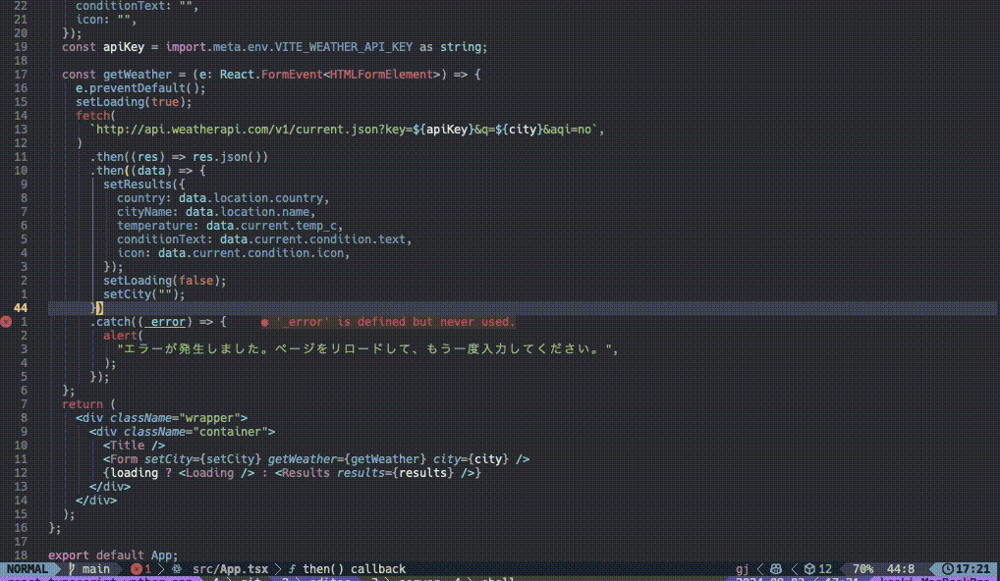

## 概要

前回の [GitHub Copilot Chatのプロンプトをスニペット化し、nvim-cmpと連携する方法](../github-copilot-chat-snippet/index.md) では、スニペットを使ってGitHub Copilot Chatのプロンプトを効率よく使う方法を紹介しました。今回は、Gitのコミットメッセージを生成してクリップボードにコピーする方法を紹介します。


## 設定方法

以下の環境を前提に話を進めます。別の環境の場合は適宜読み替えてください。

        $ sw_vers
        ProductName:            macOS
        ProductVersion:         14.6.1
        BuildVersion:           23G93
        
        $ nvim -v
        NVIM v0.10.1
        Build type: Release
        LuaJIT 2.1.1723675123
        
        CopilotChat.nvim
            branch canary
            commit 1a92bb6

### CopilotChat.nvimの設定

以下のようなプロンプトを変数定義しておきます。

```lua
local commit_staged_prompt = [[
以下の条件を踏まえて変更に対するコミットメッセージを書いてください。

- コミットメッセージのprefixは、commitizenの規約に従ってください。
- コミットメッセージ本文は日本語で書いてください。
- タイトルは最大50文字、変更理由を含めてください。
- メッセージは72文字で折り返してください。
- メッセージ全体をgitcommit言語のコードブロックで囲んでください。
- ソースを見ても変更した理由がわからない時は、コミットメッセージを作る前に質問して、その回答も参考にコミットメッセージを生成してください。
]]
```

CopilotChat.nvimの設定ファイルに以下のように設定します。
1. 8行目にて、さっきのプロンプトを文字列結合して代入しています。
2. 12~L17行目は、プロンプトの内容にコミットメッセージが含まれていた時にクリップボードにコピーするための設定です。

```lua
return {
  "CopilotC-Nvim/CopilotChat.nvim",
  branch = "canary",
  cmd = "CopilotChat",
  opts = {
    prompts = {
      CommitStaged = {
        prompt = "/COPILOT_GENERATE" .. commit_staged_prompt,
        selection = function(source)
          return select.gitdiff(source, true)
        end,
        callback = function(response, _)
          local commit_message = response:match("```gitcommit(.-)```")
          if commit_message then
            vim.fn.setreg("+", commit_message, "c")
          end
        end,
      }
    }
  }
}


```

## 使い方

実際に使っている様子をGIFで紹介します。
不要な変数を削除して、コミットメッセージを生成してクリップボードにコピーしています。
コピーしたコミットメッセージを使って、 [LazyGit](https://github.com/jesseduffield/lazygit) にてコミットを行います。



## 一緒に読みたい記事

- [GitHub Copilot Chatのプロンプトをスニペット化し、nvim-cmpと連携する方法](../github-copilot-chat-snippet)
- [NeovimでGitHub Copilot Chatを使う方法](../github-copilot-chat-nvim)
