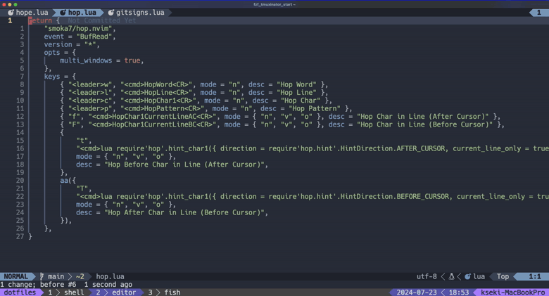
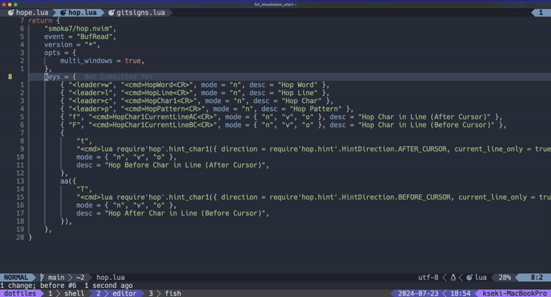
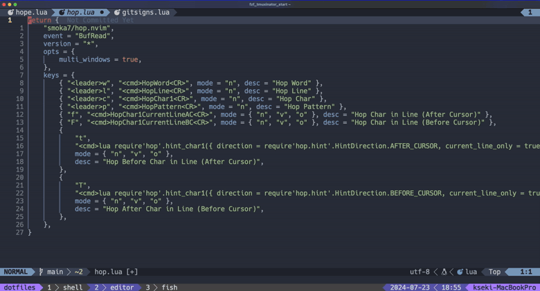
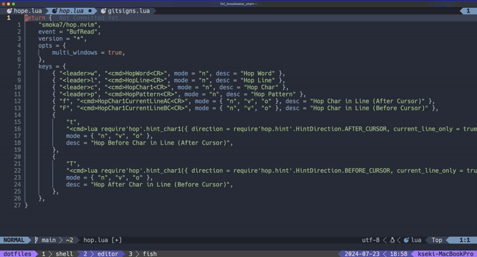

## 概要

この記事では、Neovimのhop.nvimプラグインについて説明します。hop.nvimはカーソル移動のプラグインで、できるだけ少ないキー操作で任意の場所にジャンプできるようになります。以下では、その設定方法と具体的な使用例について詳しく説明します。

<div class="iframely-embed"><div class="iframely-responsive" style="height: 140px; padding-bottom: 0;"><a href="https://github.com/hadronized/hop.nvim" data-iframely-url="//iframely.net/f2fMy4b?card=small"></a></div></div>

## 設定

自分の設定例です。プラグイン管理がLazyの場合は、以下のように設定できます。

```lua
return {
	"smoka7/hop.nvim",
	event = "BufRead",
	version = "*",
	opts = {
		multi_windows = true,
	},
	keys = {
		{ "<leader>w", "<cmd>HopWord<CR>", mode = "n", desc = "Hop Word" },
		{ "<leader>l", "<cmd>HopLine<CR>", mode = "n", desc = "Hop Line" },
		{ "<leader>c", "<cmp>HopChar1<CR>", mode = "n", desc = "Hop Char" },
		{ "<leader>p", "<cmd>HopPattern<CR>", mode = "n", desc = "Hop Pattern" },
		{ "f", "<cmd>HopChar1CurrentLineAC<CR>", mode = { "n", "v", "o" }, desc = "Hop Char in Line (After Cursor)" },
		{ "F", "<cmd>HopChar1CurrentLineBC<CR>", mode = { "n", "v", "o" }, desc = "Hop Char in Line (Before Cursor)" },
		{
			"t",
			"<cmd>lua require'hop'.hint_char1({ direction = require'hop.hint'.HintDirection.AFTER_CURSOR, current_line_only = true, hint_offset = -1 })<CR>",
			mode = { "n", "v", "o" },
			desc = "Hop Before Char in Line (After Cursor)",
		},
		{
			"T",
			"<cmd>lua require'hop'.hint_char1({ direction = require'hop.hint'.HintDirection.BEFORE_CURSOR, current_line_only = true, hint_offset = 1 })<CR>",
			mode = { "n", "v", "o" },
			desc = "Hop After Char in Line (Before Cursor)",
		},
	},
}
```

## 使い方

### HopWord: 画面上の特定の単語の先頭にジャンプしたい時

8行目の`keys`の上にカーソルがあります。そこから7行上の`return`の先頭にカーソルをジャンプしたい時の例です。
コマンド的には、`<Space>w`, `y`でジャンプしています。

ステップで説明すると以下です。
1. `return`より11行下の`mode`に目線を移す。
2. `<Space>w`（HopWordコマンド実行キーマップ）をタイプ
3. 目線にあるハイライトされた文字`ng`をタイプして移動完了



### HopLine: 特定の行に直接ジャンプしたい時

現在、カーソルが8行目の`keys`の上にあります。そこから7行上の`return`の行にカーソルをジャンプしたい時の例です。
コマンド的には、`<Space>l`, `y`でジャンプしています。

ステップで説明すると以下です。
1. `keys`より7行下の`return`に目線を移す。
2. `<Space>l`（HopLineコマンド実行キーマップ）をタイプ
3. 目線にあるハイライトされた文字`y`をタイプして移動完了



### HopChar1: 画面上の特定の文字にジャンプしたい時

現在、カーソルが1行目の`return`の上にあります。そこから18行下の`Hop Before Char ...`の行の先頭にジャンプしたい時の例です。
コマンド的には、`<Space>c`, `H`, `<Enter>`, `r`でジャンプしています。



### HopPattern: 画面上の特定のパターンにジャンプしたい時

現在、カーソルが1行目の`return`の上にあります。そこから16行下の`HintDirection`の`D`の位置にジャンプしたときの例です。

ステップで説明すると以下です。
1. `return`より16行下の`HintDirection`の`D`の位置に目線を移す。
2. `<Space>p`（HopPatternコマンド実行キーマップ）をタイプ
3. ジャンプしたいパターン`direaction`をタイプ
4. 目線にあるハイライトされた文字`s`をタイプして移動完了



## まとめ

この記事では、Neovimのhop.nvimプラグインの設定方法と使用例について説明しました。hop.nvimは、少ないキー操作で任意の場所にジャンプすることを可能にする強力なカーソル移動ツールです。

HopWord, HopLine, HopChar1, そして HopPatternといった主要なコマンドを使用することで、効率的にコードをナビゲートできます。これらのコマンドは、特定の単語、行、文字、またはパターンにジャンプするためのものです。

さらに、hop.nvimにはこれら以外にも多くの機能と設定オプションがあります。例えば、異なるウィンドウ間でのジャンプや、カーソル位置に基づいたジャンプなどが可能です。詳細は[公式GitHubリポジトリ](https://github.com/smoka7/hop.nvim)を参照してください。

このプラグインを活用することで、あなたのコーディング体験はさらに向上するでしょう。


