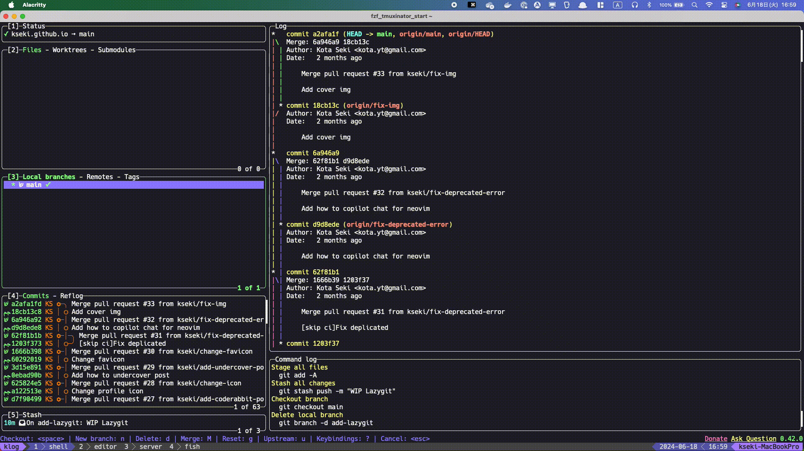
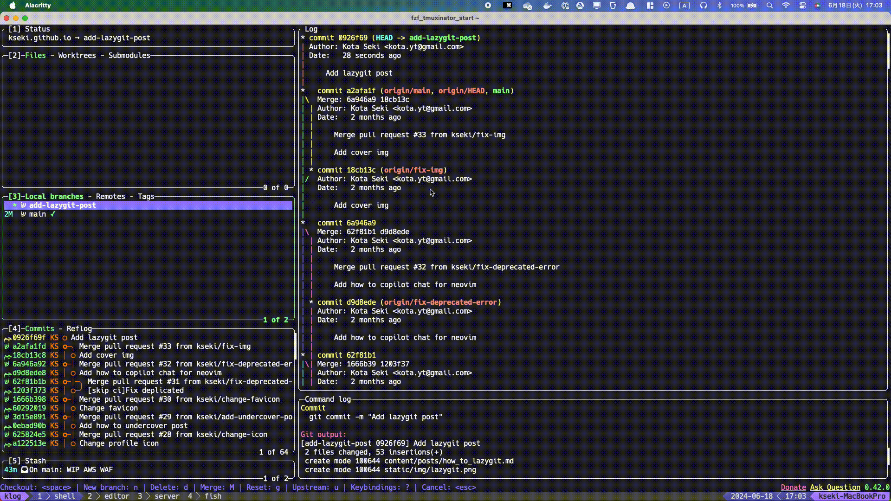

## 概要

Lazygitは、開発者の生産性を向上させるために設計された、コマンドラインツールです。このツールは、Gitの操作を簡単かつ効率的に行うことができるインターフェースを提供します。ステータスの確認、コミットの作成、ブランチの切り替えなどの一般的なGit操作を簡単に行うことができます。

## インストール方法

MacOSユーザーは、Homebrewを使用してLazygitを簡単にインストールできます。ターミナルを開き、以下のコマンドを実行します。

```
brew install lazygit
```

※他のインストール方法は[こちら](https://github.com/jesseduffield/lazygit?tab=readme-ov-file#installation)

## チュートリアル

READMEに[チュートリアル](https://github.com/jesseduffield/lazygit?tab=readme-ov-file#tutorials)動画へのリンクがあるので一度やってみることをお勧めします！

## GitHubと連携して一連の開発作業のやり方

Lazygitを使用してGitHubと連携し、開発作業を行うプロセスは以下の通りです。

1. **ブランチを作成**
   リポジトリ内で新しいブランチを作成し、特定の機能や修正に取り組みます。
   ベースブランチの上にカーソルを合わせて`c`を押すとダイアログが表示されるので、ブランチ名を入力してEnterキーを押すだけです。

   

2. **ファイルを編集してコミット**
   必要なファイルを編集し、変更をコミットします。Lazygitでは、変更をステージングし、コミットメッセージを入力することが容易です。
   コミットしたいディレクトリ、またはファイルにカーソルを合わせて`Space`キーを押してステージング。`c`を押すとダイアログが表示されるのでコミットメッセージを入力してEnterキーを押す。

   

3. **リモートリポジトリーにpush、PRの作成**
   コミットした変更をリモートリポジトリにpushします。GitHub上でPRを作成します。
   Pushしたいリポジトリにカーソルを合わせて`P`を押しEnterするだけです。（リモートリポジトリが存在する場合は`p`でOKです。）
   Pushが終わったら、PR作成したいリポジトリにカーソルを合わせて`o`を押すと、ブラウザでPR作成画面が表示されます。

   

他にも [たくさんの機能](https://github.com/jesseduffield/lazygit?tab=readme-ov-file#features) や [カスタムコマンド](https://github.com/jesseduffield/lazygit/blob/master/docs/Custom_Command_Keybindings.md) を追加出来ます！

## まとめ

Lazygitは、Gitの操作を簡単にし、開発者の作業を効率化する強力なツールです。その直感的なUIと豊富な機能により、開発プロセスがよりスムーズになります。この記事がLazygitの導入と利用の手助けになれば幸いです。

## 参考

- [jesseduffield/lazygit: simple terminal UI for git commands](https://github.com/jesseduffield/lazygit)
