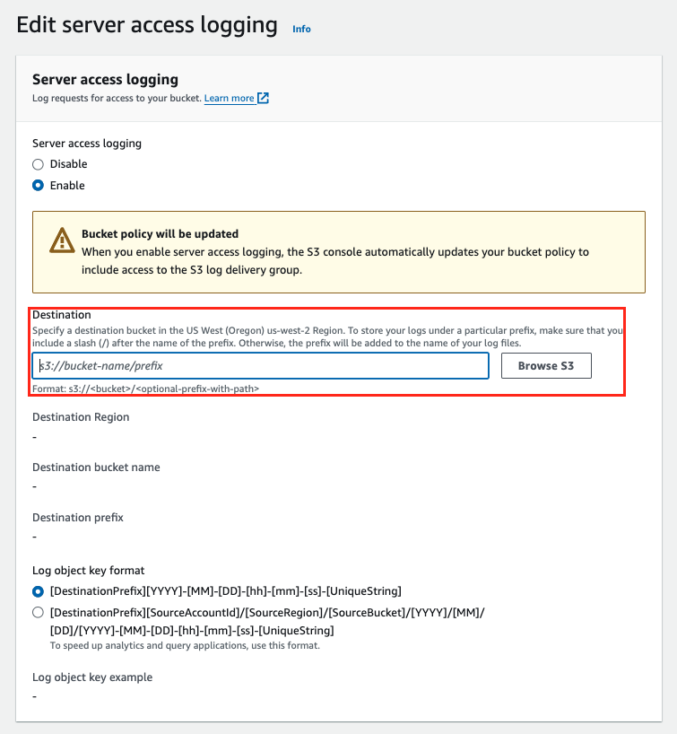
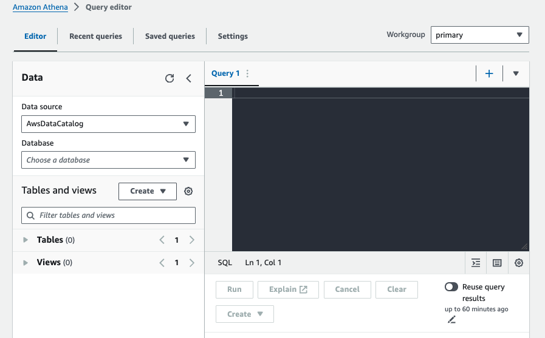
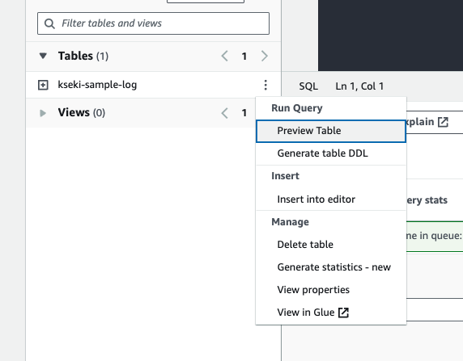

## 概要

Amazon S3のファイルへのアクセスログをAmazon Athenaで確認する方法です。

## ステップ1: S3バケットのサーバーアクセスログを有効にする

まず、S3バケットでサーバーアクセスログを有効にする必要があります。これにより、アクセスされるたびにログが記録され、後で分析するために使用できます。



## ステップ2: Amazon Athenaコンソールを開く

次に、Amazon Athenaコンソールにアクセスし、クエリエディタを使用してデータベースとテーブルを作成します。



## ステップ3: データベースを作成する

Athenaで新しいデータベースを作成し、アクセスログデータの格納場所として設定します。
今回は、デフォルトで用意されている`default`を使います。

## ステップ4: テーブルスキーマを作成する

アクセスログデータの構造を定義するテーブルスキーマを作成します。
以下のクエリを実行します。

```sql
CREATE EXTERNAL TABLE `default.<データベース名>`(
  `bucketowner` STRING,
  `bucket_name` STRING,
  `requestdatetime` STRING,
  `remoteip` STRING,
  `requester` STRING,
  `requestid` STRING,
  `operation` STRING,
  `key` STRING,
  `request_uri` STRING,
  `httpstatus` STRING,
  `errorcode` STRING,
  `bytessent` BIGINT,
  `objectsize` BIGINT,
  `totaltime` STRING,
  `turnaroundtime` STRING,
  `referrer` STRING,
  `useragent` STRING,
  `versionid` STRING,
  `hostid` STRING,
  `sigv` STRING,
  `ciphersuite` STRING,
  `authtype` STRING,
  `endpoint` STRING,
  `tlsversion` STRING,
  `accesspointarn` STRING,
  `aclrequired` STRING)
ROW FORMAT SERDE
  'org.apache.hadoop.hive.serde2.RegexSerDe'
WITH SERDEPROPERTIES (
  'input.regex'='([^ ]*) ([^ ]*) \\[(.*?)\\] ([^ ]*) ([^ ]*) ([^ ]*) ([^ ]*) ([^ ]*) (\"[^\"]*\"|-) (-|[0-9]*) ([^ ]*) ([^ ]*) ([^ ]*) ([^ ]*) ([^ ]*) ([^ ]*) (\"[^\"]*\"|-) ([^ ]*)(?: ([^ ]*) ([^ ]*) ([^ ]*) ([^ ]*) ([^ ]*) ([^ ]*) ([^ ]*) ([^ ]*))?.*$')
STORED AS INPUTFORMAT
  'org.apache.hadoop.mapred.TextInputFormat'
OUTPUTFORMAT
  'org.apache.hadoop.hive.ql.io.HiveIgnoreKeyTextOutputFormat'
LOCATION
  's3://<S3バケット名>/<ディレクトリ>/'

```

## ステップ5: テーブルをプレビューする

作成したテーブルスキーマが正しく機能しているかを確認するために、テーブルのプレビューを行います。



## ステップ6: クエリを実行する

最後に、Athenaのクエリエディタを使用して、特定の条件に基づいてログデータをクエリします。例えば、特定のオブジェクトに対するDELETE操作や、特定のエラーコードを持つリクエストを検索できます。

<details>
  <summary>特定のオブジェクトの特定期間のGETログを見る</summary>

```sql
SELECT *
FROM default.<データベース名>
WHERE Key='prefix/images/picture.jpg'
    AND operation='REST.GET.OBJECT'
    AND parse_datetime(requestdatetime,'dd/MMM/yyyy:HH:mm:ss Z')
    BETWEEN parse_datetime('2024-06-18:07:00:00','yyyy-MM-dd:HH:mm:ss')
    AND parse_datetime('2024-06-18:08:00:00','yyyy-MM-dd:HH:mm:ss');
```

</details>

## 参考

- [Amazon S3 アクセスログを使用したリクエストの識別 - Amazon Simple Storage Service](https://docs.aws.amazon.com/ja_jp/AmazonS3/latest/userguide/using-s3-access-logs-to-identify-requests.html)


